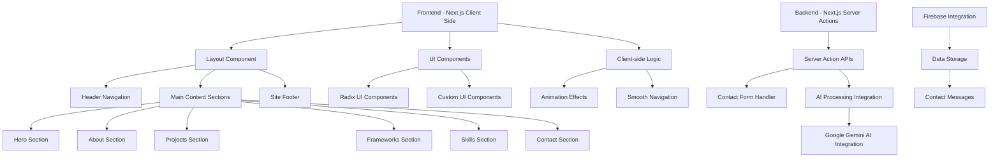
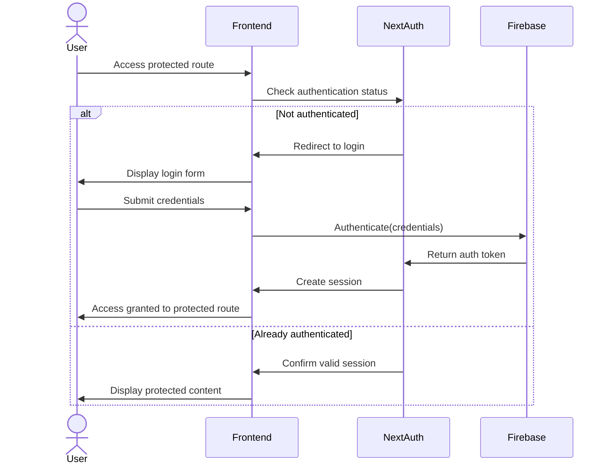
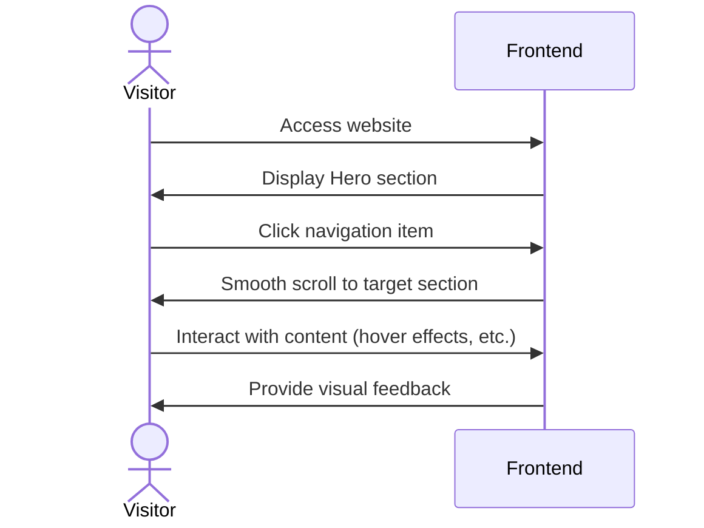
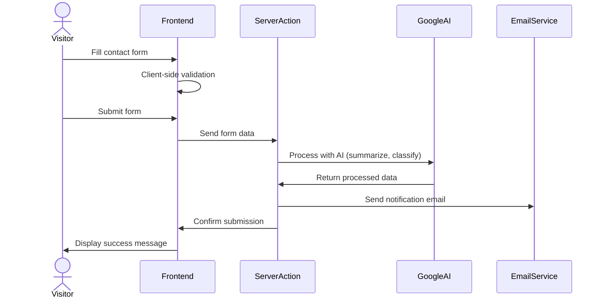
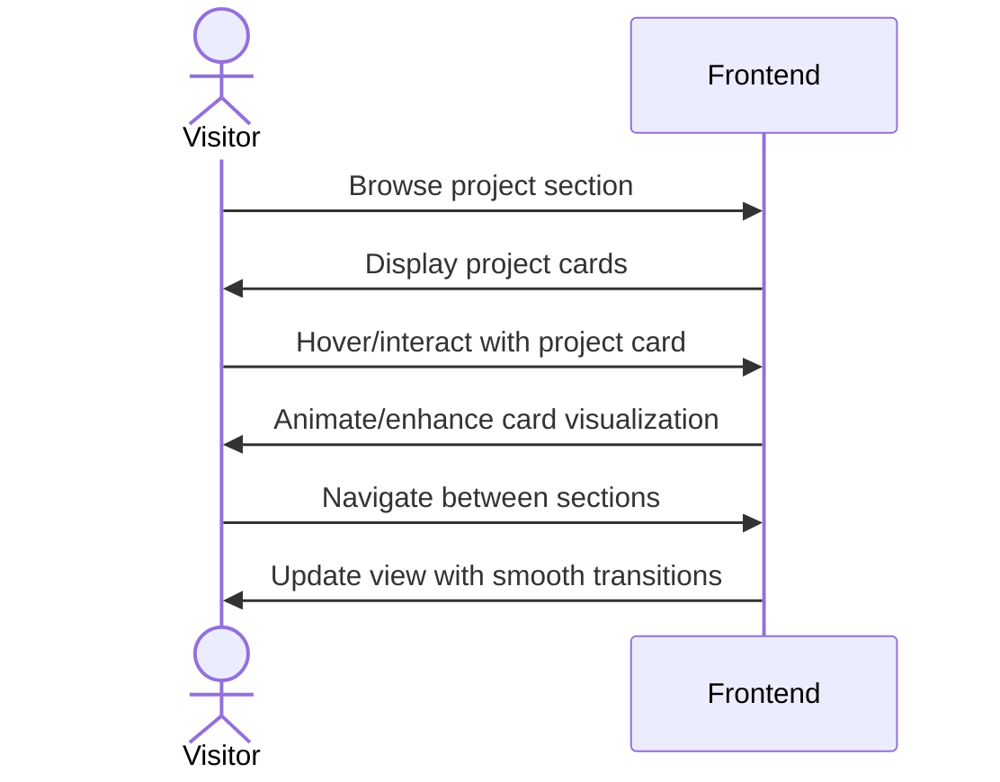

# Architectural Document: Jacob Kazadi Kayembe Personal Brand Site

## 1. High-Level Application Overview and Purpose

The Jacob Kazadi Kayembe Personal Brand Site is a modern, responsive web application designed to showcase Jacob's professional identity as an "AI-Enabled Full Stack Marketer". The site serves as a digital portfolio and platform for potential clients to learn about Jacob's skills, projects, and service offerings in AI strategy, digital transformation, and marketing operations.

### Core Purpose:
- Establish professional branding and online presence
- Showcase expertise in AI integration, strategic communications, and digital transformation
- Display portfolio of projects and frameworks
- Facilitate direct client/visitor contact through an AI-enhanced contact system
- Demonstrate technical competency through the site's implementation

## 2. Main Components



### 2.1 Frontend
- Single-page web application built with Next.js 15
- Component-based architecture using React 18
- Responsive design for all device sizes
- Multiple interactive sections (Hero, About, Projects, etc.)
- Modern UI with animations, transitions, and particle effects

### 2.2 Backend
- Serverless architecture using Next.js Server Actions
- AI integration via Genkit for contact form intelligence
- Google AI (Gemini 2.0) for natural language processing
- Firebase potential integration for data persistence (configured but not fully implemented)

### 2.3 External Integrations
- Google AI/Gemini 2.0 via Genkit for contact form intelligence
- Potential email notification system for form submissions
- Google Fonts for typography

## 3. Key Data Models

### 3.1 Contact Form Submission
```typescript
interface ContactFormSubmission {
  name: string;       // The person's full name
  email: string;      // Contact email address
  project: string;    // Type of project interest
  message: string;    // Detailed inquiry message
  timestamp: Date;    // When the submission was received
}
```

### 3.2 AI-Processed Contact Form
```typescript
interface SmartContactFormOutput {
  summary: string;            // AI-generated summary of the message
  urgency: 'high' | 'medium' | 'low';  // AI-classified priority
  suggestedResponses: string[];  // AI-suggested response options
}
```

### 3.3 Project Model
```typescript
interface Project {
  role: string;       // Professional role in the project
  title: string;      // Project title
  description: string; // Project description
  tags: string[];     // Technologies/methodologies used
}
```

### 3.4 Skill Category Model
```typescript
interface SkillCategory {
  title: string;      // Category name (e.g., "AI & Emerging Technologies")
  skills: string[];   // List of specific skills in this category
}
```

## 4. Authentication/Authorization Flow

The current implementation does not include user authentication or authorization. The site functions as a public-facing portfolio and contact platform without restricted areas that require authentication.

If future enhancements were to include authentication (e.g., for a client portal or content management):



## 5. Core Workflows

### 5.1 Visitor Page Navigation



### 5.2 Contact Form Submission & AI Processing



### 5.3 Project & Framework Exploration



## 6. Tech Stack

### 6.1 Frontend
- **Framework**: Next.js 15.3.3
- **UI Library**: React 18.3.1
- **Component Libraries**:
  - Radix UI (accessible UI primitives)
  - Shadcn UI components
- **Styling**: 
  - TailwindCSS 3.4.1
  - CSS Modules
  - CSS-in-JS (via tailwind-merge, clsx)
- **Animation**: 
  - Custom CSS animations
  - React hooks for interactive effects
- **Data Visualization**: Recharts (not actively used but available)

### 6.2 Backend
- **Server**: Next.js Server Actions (Edge Runtime)
- **AI Integration**: 
  - Genkit 1.8.0
  - Google AI (Gemini 2.0 via @genkit-ai/googleai)
- **Form Validation**: 
  - React Hook Form
  - Zod schema validation
- **API Handling**: Server Actions

### 6.3 Database/Storage
- **Configured Integration**: Firebase 11.8.1 (not fully implemented in current code)
- **Potential Uses**:
  - Contact form submissions storage
  - Project data management
  - Analytics integration

### 6.4 Deployment & Infrastructure
- **Hosting**: Firebase App Hosting (configured via apphosting.yaml)
- **Build System**: Next.js build system with Turbopack
- **Development Environment**: 
  - TypeScript 5.x
  - ESLint
  - Firebase Emulators (configured for local development)

## 7. Design Patterns and Architecture Decisions

### 7.1 Component Architecture
- Hierarchical component structure with clear separation of concerns
- Reusable UI components for consistency across the application
- Component composition pattern for flexible UI assembly
- Container/presentational pattern for separation of logic and presentation

### 7.2 State Management
- Local React state for UI interactions
- Form state managed with React Hook Form
- No global state management solution (Redux, Zustand, etc.) as the application complexity doesn't require it

### 7.3 AI Integration Strategy
- Server-side AI processing to protect API keys
- Defined schema for AI inputs and outputs using Zod
- Prompt engineering for reliable AI responses
- Separation of AI service from UI components

### 7.4 Performance Optimizations
- Next.js App Router for optimized routing and rendering
- Component-level code splitting
- Image optimization via Next.js Image component
- Lightweight animations using CSS transitions over JavaScript

## 8. Future Enhancement Opportunities

1. **Full Firebase Integration**:
   - Implement contact form submission storage
   - Add analytics tracking
   - Create admin dashboard for message management

2. **Enhanced AI Features**:
   - Add AI-powered chatbot for visitor interactions
   - Implement content recommendation based on visitor behavior
   - Expand AI capabilities in form processing

3. **Authentication System**:
   - Add protected client portal
   - Implement authentication for admin functions
   - Create user profiles for returning visitors

4. **Content Management System**:
   - Add dynamic content management for projects and skills
   - Implement a headless CMS integration
   - Create an admin interface for content updates

5. **Analytics & Tracking**:
   - Implement comprehensive analytics
   - Add conversion tracking
   - Create performance dashboards

This architectural document provides a comprehensive overview of the Jacob Kazadi Kayembe Personal Brand Site, detailing its structure, components, workflows, and technical implementation. The document serves as both documentation of the current state and a guide for future development and enhancement.
