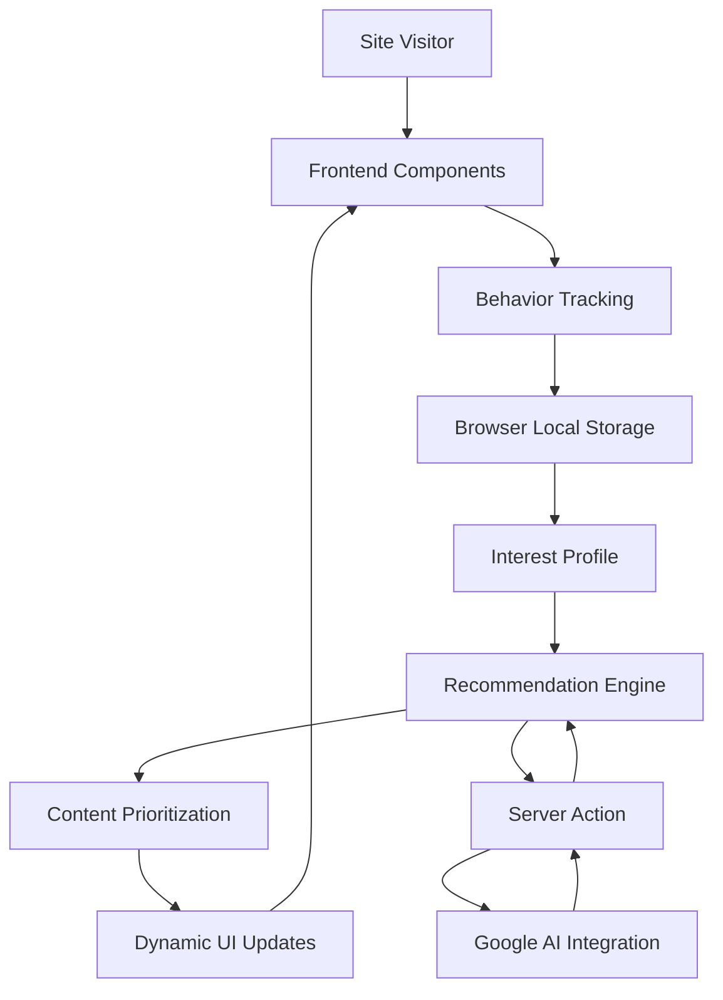

# Product Requirements Document (PRD)

## Feature Name: AI-Powered Portfolio Recommendation Engine

## Problem Statement
Visitors to Jacob's personal brand site currently need to manually explore all sections of the portfolio to find relevant projects and expertise that match their specific business needs. This creates friction in the user journey and may result in potential clients missing the most relevant aspects of Jacob's work that could address their specific challenges.

For a consultancy focused on AI-enabled marketing and digital transformation, the website itself should demonstrate intelligent, personalized interactions. Currently, the site shows the same static content to all visitors without any personalization or guidance tailored to their interests or needs.

## User Stories

1. **As a** potential client interested in AI integration,  
   **I want to** quickly find projects and frameworks relevant to my industry and specific needs,  
   **So that** I can determine if Jacob has the right expertise for my project without searching through irrelevant content.

2. **As a** marketing director exploring automation options,  
   **I want to** see a personalized view of Jacob's capabilities in marketing automation,  
   **So that** I can assess his specific expertise in this area without distraction.

3. **As a** business owner with limited technical knowledge,  
   **I want to** have content explained in terms relevant to my business outcomes rather than technical jargon,  
   **So that** I can understand the value proposition without needing technical expertise.

4. **As a** returning visitor to the site,  
   **I want to** pick up where I left off and see new or previously unexplored content relevant to my interests,  
   **So that** I don't waste time revisiting the same information.

5. **As a** project manager looking for specific skills,  
   **I want to** quickly assess whether Jacob has expertise in particular tools or methodologies,  
   **So that** I can evaluate compatibility with my existing tech stack or project requirements.

## Functional Requirements

### 1. Interest Detection System
- Implement tracking of visitor behavior (page sections viewed, time spent on content types, scrolling patterns)
- Create an algorithm to infer visitor interests based on browsing behavior
- Store anonymized interest profiles using browser local storage (no account required)

### 2. Dynamic Content Prioritization
- Develop a scoring system for matching content relevance to detected interests
- Create a recommendation engine to reorder or highlight projects, frameworks, and skills based on relevance score
- Implement visual indicators for recommended content (e.g., subtle highlighting or "Recommended for you" labels)

### 3. Interactive Interest Selection
- Design an optional non-intrusive prompt allowing visitors to explicitly indicate their interests
- Create a simple interface with industry/need categories to select from
- Develop a mechanism to combine explicit selections with observed behavior for improved recommendations

### 4. Personalized Path Guidance
- Implement subtle visual cues (e.g., animated arrows, enhanced contrast) to guide visitors to content matching their interests
- Create "You might also be interested in..." suggestions at the end of each section
- Develop smooth scrolling transitions between recommended content sections

### 5. Contextual Explanation Layer
- Create alternative business-focused descriptions for technical projects that automatically display based on detected user technical proficiency
- Implement contextual tooltips explaining technical terms when hovering over them
- Develop dynamic examples that relate Jacob's work to the visitor's likely industry (based on their interest profile)

### 6. Recommendation API Integration
- Integrate with the existing Google AI functionality to enhance content recommendations
- Create a server action endpoint for processing behavioral data and generating recommendations
- Implement caching mechanisms to improve performance for returning visitors

## Non-Functional Requirements

### 1. Performance
- The recommendation engine must not impact page load time by more than 300ms
- Recommendation calculations must execute in under 100ms
- Interface updates based on recommendations must be smooth with no visible lag

### 2. Privacy & Data Security
- No personally identifiable information (PII) should be collected or stored
- All visitor behavior tracking must be anonymous and stored only in local browser storage
- Comply with GDPR, CCPA, and other relevant privacy regulations
- Provide clear opt-out mechanisms for behavior tracking

### 3. Accessibility
- All recommended content indicators must maintain WCAG 2.1 AA compliance
- Interactive elements must be fully keyboard-accessible
- Color contrast for highlighted recommendations must meet accessibility standards
- Screen reader compatibility for all dynamic content changes

### 4. Compatibility
- Solution must work across all modern browsers (Chrome, Firefox, Safari, Edge)
- Mobile responsiveness for all recommendation features
- Graceful degradation for browsers with JavaScript disabled

### 5. Maintainability
- Clean separation between recommendation logic and UI components
- Comprehensive documentation of the recommendation algorithm
- Configurable recommendation parameters that can be adjusted without code changes
- Unit tests for recommendation engine with at least 80% coverage

## Out of Scope (for MVP)

The following items will NOT be included in the first version of the feature:

1. User accounts or login functionality
2. Cross-device profile synchronization
3. Explicit rating system for content (e.g., "Was this helpful?")
4. Integration with external CRM or marketing automation platforms
5. Advanced analytics dashboard for recommendation performance
6. A/B testing framework for recommendation algorithms
7. Machine learning models that require server-side training
8. Integration with third-party recommendation services
9. Personalized contact form fields based on detected interests
10. Real-time chat assistance based on detected interests

## Success Metrics

### Primary Metrics
1. **Engagement Depth**: 20% increase in average number of sections viewed per visit
2. **Time on Site**: 30% increase in average session duration
3. **Contact Rate**: 15% increase in contact form submissions
4. **Content Discovery**: 25% increase in visitors viewing at least 3 different project cards

### Secondary Metrics
1. **Return Rate**: 10% increase in returning visitor percentage
2. **Bounce Rate**: 15% decrease in bounce rate for new visitors
3. **Mobile Engagement**: Parity of engagement metrics between desktop and mobile users
4. **Path Efficiency**: Decrease in time to reach contact form for visitors who eventually submit it

### Qualitative Metrics
1. User satisfaction measured through optional feedback forms
2. Quality of contact form submissions (relevance, specificity of inquiries)
3. Client feedback on how effectively the site communicated Jacob's relevant expertise

## Implementation Phases

### Phase 1: Foundation (Weeks 1-2)
- Set up anonymous behavior tracking
- Implement basic interest detection algorithm
- Create preliminary recommendation logic

### Phase 2: User Interface (Weeks 3-4)
- Develop visual indicators for recommended content
- Implement interactive interest selection interface
- Create contextual explanation layer

### Phase 3: AI Integration (Weeks 5-6)
- Integrate with Google AI via Genkit
- Refine recommendation algorithms based on testing
- Implement performance optimizations

### Phase 4: Testing & Refinement (Weeks 7-8)
- Conduct usability testing
- Optimize performance
- Make adjustments based on user feedback

## Technical Considerations

This feature aligns with the existing architecture as documented in the architectural document:

1. It leverages the existing Next.js frontend structure
2. It can utilize the Server Actions pattern already in place
3. It can integrate with the existing Google AI functionality via Genkit
4. It maintains the component-based architecture
5. It follows the established UI patterns using Radix UI components

The recommendation engine will fit into the overall architecture as follows:

## Risks and Mitigations

| Risk | Impact | Likelihood | Mitigation |
|------|--------|------------|------------|
| Privacy concerns from visitors | High | Medium | Clear opt-out options, anonymous tracking only, transparent privacy policy |
| Performance degradation | High | Low | Efficient client-side algorithms, lazy loading, performance testing |
| Inaccurate recommendations | Medium | Medium | Regular algorithm refinement, fallback to default sorting |
| Browser compatibility issues | Medium | Low | Cross-browser testing, progressive enhancement |
| Confusion from dynamic content changes | Medium | Medium | Subtle transitions, clear visual indicators, consistent UI patterns |
